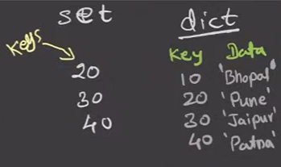
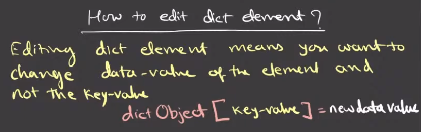
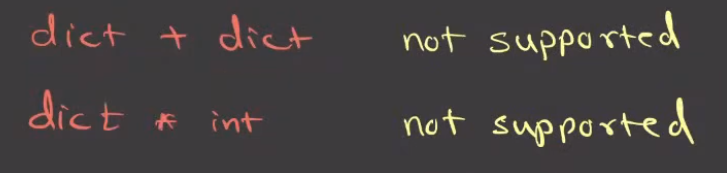
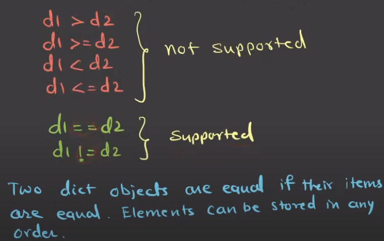

# Dict
- dict is a class.
- dict is **mutable**.
- dict is **not a sequence**. (and hence there is no concept of indexing.)
- dict is **iterable**.
- **Indexing is not applicable** to dict object.
- dict **cannot have duplicate keys** (not data values).
- dict elements are pair of key and value.
- Slicing Operator is not applicable. (because there is no indexing.)


# How to edit dict element

and if you want to delete whole pair, you can delete it like this: `del dict_name[key]`.
But you can not delete only value without deleting key or change the key in existing key-value pair. 

# Dictionary Methods
- Using the `keys()`, `values()`, and `items()` methods to get keys, values, and key-value pairs respectively.
- All these methods are `dict` class attributes.

## Example: `d7 = {'a': 1, 'b': 2, 'c': 3}`
### Returns a view object displaying a list of all the keys in the dictionary
print(d7.keys()) # Output: dict_keys(['a', 'b', 'c'])

### Returns a view object displaying a list of all the values in the dictionary
print(d7.values())  # Output: dict_values([1, 2, 3])

### Returns a view object displaying a list of all the key-value pairs in the dictionary
print(d7.items())  # Output: dict_items([('a', 1), ('b', 2), ('c', 3)])

### what is view object?
- A view object is a dynamic view on the dictionary’s entries, which means that when the dictionary changes, the view reflects these changes.
- For example, if you modify the dictionary after creating a view object, the view will reflect those changes.
- Example of view object
```
d7_view = d7.items()  # Create a view object of the items in the dictionary
print(d7_view)  # Prints the current items in the dictionary
Output: dict_items([('a', 1), ('b', 2), ('c', 3)])
```

# Built-in Functions
- `len()`
- `min()`
- `max()`
- `sum()`
- `sorted()`

# Dict Object Methods
- `pop(key)`: Removes a key-value pair by key
- `popitem()`: Removes and returns an arbitrary key-value pair
- `clear()`: Removes all key-value pairs from the dictionary

# Concatenation and Repetition Operator
**Not Supported in `dict`**


# Comparison Operator
 

# Dictionary Comprehensions
d1 = {key-expression : data-expression for e in sequence}
Ex - A dictionary of squares: `d14 = {x: x**2 for x in range(5)}`
