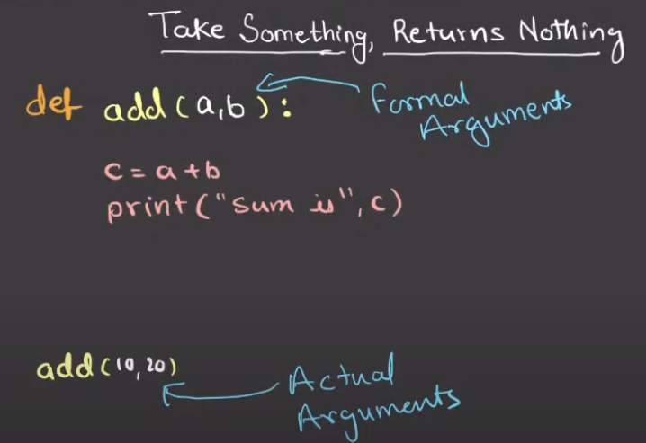
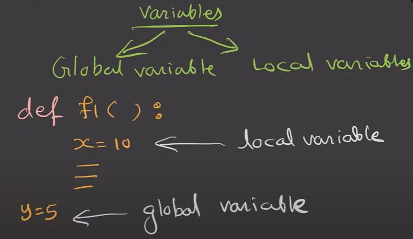
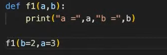
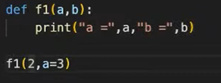
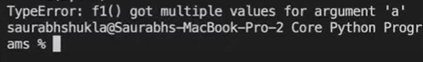
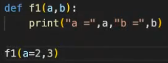
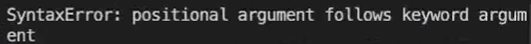
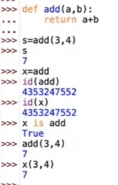
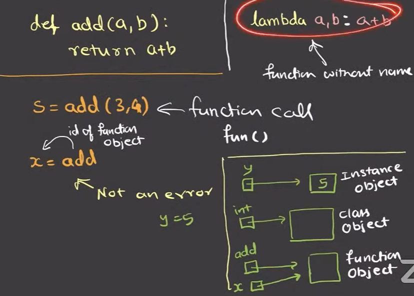

# Function
- Function is a block of code which only runs when it is called.
- Function has a name for identification.

# Function Definition
```
def function_name(args):
    code
```


# Arguments Types
| Type                          | Example                   | Key Point                              |
| ----------------------------- | ------------------------- | -------------------------------------- |
| Positional                    | `def add(x, y):`          | Arguments assigned by position         |
| Keyword                       | `add(x=2, y=3)`           | Assigned by parameter name             |
| Default                       | `def greet(name="Guest")` | Default value used if not provided     |
| Variable Positional (`*args`) | `def func(*args):`        | Accepts unlimited positional arguments |
| Variable Keyword (`**kwargs`) | `def func(**kwargs):`     | Accepts unlimited keyword arguments    |

NOTE: You can not have non default argument after default argument.

# Argument Rules (Order Matters!)
Correct order:
1. Positional arguments
2. Default arguments
3. *args
4. **kwargs

This would raise SyntaxError:
`def wrong(a=1, b): pass`

# Global and Local variables


| Scope              | Description                                                 |
| ------------------ | ----------------------------------------------------------- |
| Local              | Defined inside function, accessible only inside             |
| Global             | Defined outside function, accessible everywhere             |
| `global` keyword   | To modify global variable inside function                   |
| `nonlocal` keyword | To modify enclosing function’s variable in nested functions |

# Example of Keyword Argument and Errors
 

- this will throw TypeError: 



- this will throw SyntaxError: 



# Function Object


# Lambda Function


# Why inner function retains values?
- Because of closures. 
- A closure keeps the function's environment (variables) alive even after the outer function is done executing.

# Decorators
A decorator is a function that wraps another function, adding extra behavior before/after.

Syntax :
```
@decorator_name
def function():
    pass
```
is equivalent to:
```
function = decorator_name(function)
```

## Simple Example
```
def my_decorator(func):
    def wrapper():
        print("Before function runs")
        func()
        print("After function runs")
    return wrapper

@my_decorator
def say_hi():
    print("Hi!")

say_hi()
```
**Output**:
```
Before function runs
Hi!
After function runs
```
**NOTE:** Decorators are built using closures, where the inner wrapper() function retains access to func.
- We can pass arguments to decorators.
- We can chain multiple decorators.
- Useful for logging, validation, timing, access control.

# Late Binding in Lambda
**Problematic Code:**
```
funcs = [lambda: i for i in range(3)]
print([f() for f in funcs])  # [2, 2, 2] 
```
**Explanation:**
1. `lambda: i` creates a function that returns the value of `i`.
2. `for i in range(3)` loops through `i = 0, 1, 2`.
3. But all 3 lambdas just reference `i`, they don’t store the value of `i` at the time of creation.
4. After the loop ends, `i = 2`, and all lambdas now use that.
5. So when you run `f()`, each one returns `2`.

**Corrected Version: Using Default Argument**
```
funcs = [lambda i=i: i for i in range(3)]
print([f() for f in funcs])  # [0, 1, 2]
```
Which is equivalent to:
```
funcs = []
for i in range(3):
    def make_lambda(x):
        return lambda: x
    funcs.append(make_lambda(i))

print([f() for f in funcs])  # [0, 1, 2]
```

**Explanation:**
1. `lambda i=i: i`:  now we’re giving each lambda a default value of i at the time of creation
2. So:
    - First lambda: `lambda i=0: i`
    - Second: `lambda i=1: i`
    - Third: `lambda i=2: i`
3. Now each lambda stores its own value.


