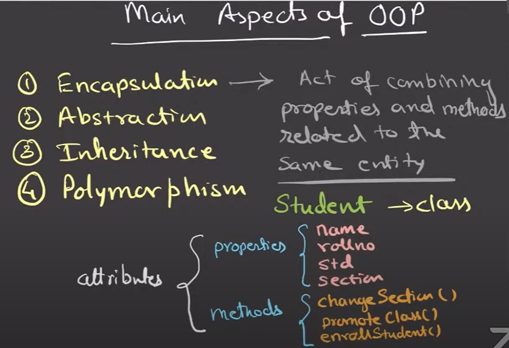
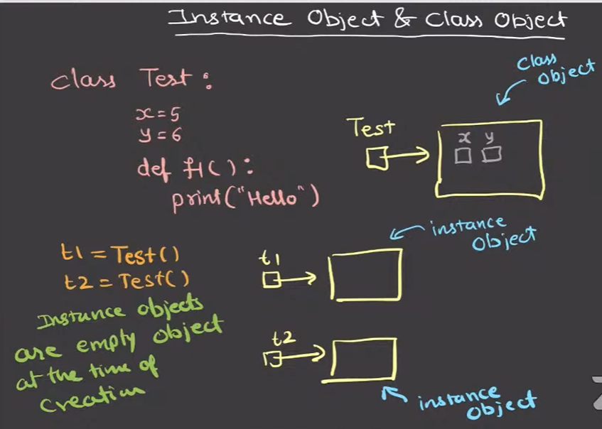

# Main Aspects of OOP
1. **Encapsulation**: Act of combining properties and methods related to the same entity.
2. **Abstraction**: 
3. **Inheriitance**:
4. **Polymorphism**:

# Instance Object and Class Object

# Types of Variables
- Instance object variable
- Class object variable (aka static variable)
- Local variable
- Global variable

**NOTE**: There is no `static` keyword in Python. 