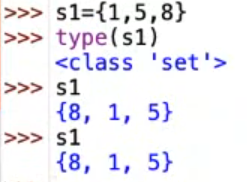
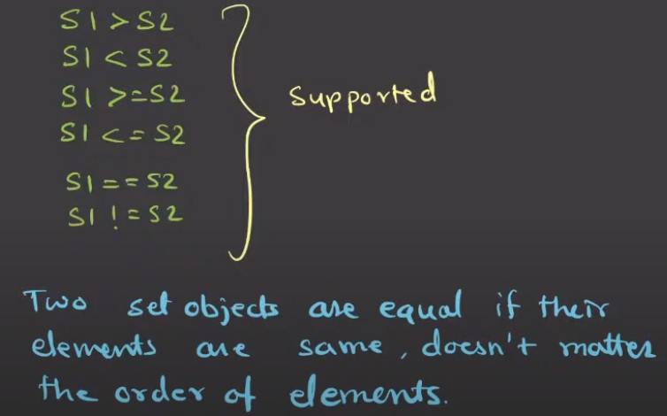
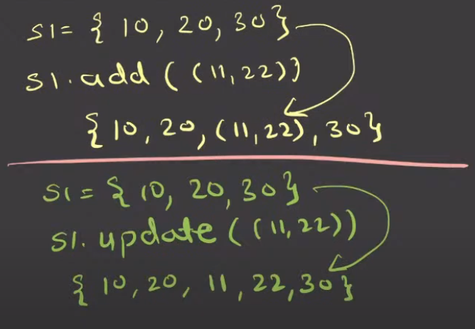

# Set
- set is a class.
- set is **mutable**.
- set is **not a sequence**. (because it does not preserve the order of elements in the same way as we have entered. But after we insert then once the internal order is made, it remains fixed.)
Ex.

- set is **iterable**.
- **Indexing is not applicable** to set object.
- Set **cannot have duplicate** values.
- Set does not guarantee to store values in the order of insertion.
- Slicing operator is not applicable.
- **Hashable**: Sets themselves aren’t hashable (can't be dict keys), but elements inside must be hashable.

# Built-in functions
- len()
- min()
- max()
- sum()
- sorted() # will return a list of sorted elements of set

# Concatenation and Repetition Operator
- set + set (**not supported**)
- set * int (**not supported**)

# Comparison Operator (Supported)

# Set Object Methods
- `add()`: Adds an element to the set.
- `update()`: Adds iterable(s) elements.
- `remove()`: Removes an element from the set. Raises KeyError if the element is not found.
- `discard()`: Removes an element from the set if it is present. Does not raise an error if the element is not found.
- `pop()`: Removes and returns an arbitrary element from the set. Raises KeyError if the set is empty.
- `clear()`: Removes all elements from the set.
- `union()`: Returns a new set with elements from the set and all others.
- `intersection()`: Returns a new set with elements common to the set and all others.
- `difference()`: Returns a new set with elements in the set that are not in the others.
- `symmetric_difference()`: Returns a new set with elements in either the set or the others but not both.
- `issubset()`: Checks if the set is a subset of another set.
- `issuperset()`: Checks if the set is a superset of another set.
- `isdisjoint()`: Checks if the set has no elements in common with another set.
- `copy()`: Returns a shallow copy of the set.

# Difference between `.add()` and `.update()`

# Set Comprehension
s1 = {expression for e in object}

# Tricky Points:
- Fast membership checks (`x in s` - `O(1)`)
- Unhashable types (like lists) cannot be elements.
Ex: Invalid: `{1, [2, 3]}` → `TypeError: unhashable type`

# Common Set Methods
| Method             | Description                                   |
| ------------------ | --------------------------------------------- |
| `add(elem)`        | Adds an element                               |
| `remove(elem)`     | Removes element (raises error if not present) |
| `discard(elem)`    | Removes if present (no error if absent)       |
| `pop()`            | Removes a random element                      |
| `clear()`          | Empties the set                               |
| `update(iterable)` | Adds multiple elements                        |
| `intersection(other_set)`, `&` | Returns common elements in both sets |
| `union(other_set)`, `|` | Returns all unique elements from both sets   |
| `difference(other_set)`, `-` | Returns elements in the first set not in the second |
| `symmetric_difference(other_set)`, `^` | Returns elements in either set but not both |
| `issubset(other_set)`, `a <= b` | Checks if all elements of the set are in another set |
| `issuperset(other_set)`, `a >= b` | Checks if the set contains all elements of another set |
| `copy()`          | Returns a shallow copy of the set            |

# Conceptual Question
1. Why use set over list?
Fast lookups, uniqueness, set operations (union, intersection).

2. Difference between `remove()` vs `discard()`?
`remove()` throws error if element absent, `discard()` doesn’t.

3. Why are sets faster for membership tests?
Because sets use hash tables for constant time lookups (`in` operator is O(1)).

4. Is set hashable?
Mutable sets aren’t hashable → can’t be dict keys or set elements.
`frozenset()` is immutable and hashable.

5. Can sets have nested sets as elements?
No. But tuples (if all elements inside are hashable) can be used:
`set_of_sets = { (1, 2), (3, 4) }

6. Why is `remove()` risky but `discard()` safe?
`remove()` raises `KeyError` if element not present, `discard()` silently ignores.

