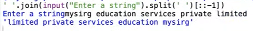

# String
- str is a class, immutable, iterable, sequence and hashable
- str is a sequence of Unicode characters

# How to Create a string
- using single quotes: ex: 'Hello'
- using double quotes: ex: "Hello"
- using triple quotes for multi-line strings: ex: '''Hello
World'''
- using str() constructor: ex: str(123)
- empty string: ex: '' or str()

# Built-in Functions:
## sum() 
- sum() does not work with strings.
- The sum() function is designed to work with numeric types, not strings.
```
s = 'hello'
sum(s) # TypeError: unsupported operand type(s) for +: 'int' and 'str'.
```
## sorted()
- sorted() can take both immutable and mutable sequences as input.
- It returns a new sorted list from the items in the iterable.
- sorted() does not modify the original sequence.
- Example: 
`sorted('World')  # returns ['d', 'l', 'o', 'r', 'W']`

# Concatenation and Repetition Operator


# Comparision Operator
`s1 > s2` -> `True` if `s1` comes after `s2` in dictionary order.

# str object methods 
- `index()` - Returns the index of the first occurrence of a substring.
- `count()` - Returns the number of occurrences of a substring.
- `find()` - Returns the lowest index of the substring if found, otherwise returns -1.
- `replace(old, new, count)` - Returns a copy of the string with all occurrences of a substring replaced by another substring.
- `split()` - Splits the string into a list of substrings based on a delimiter.
- `join()` - Joins a list of strings into a single string with a specified separator.
- `format()` - Formats the string using placeholders, allowing for variable substitution.
- `strip()`, `rstrip()`, `lstrip()` - Removes whitespaces from the string.
- `upper()` - Converts all characters in the string to uppercase.
- `lower()` - Converts all characters in the string to lowercase.
- `capitalize()` - Capitalizes the first character of the string.
- `title()` - Converts the first character of each word to uppercase and the rest to lowercase.
- `swapcase()` - Swaps the case of all characters in the string.
- `startswith()` - Checks if the string starts with a specified substring.
- `endswith()` - Checks if the string ends with a specified substring.
- `isalpha()` - Returns True if all characters in the string are alphabetic.
- `isdigit()` - Returns True if all characters in the string are digits.
- `isupper()` - Returns True if all characters in the string are uppercase.
- `islower()` - Returns True if all characters in the string are lowercase.
- `isalnum()` - Returns True if all characters in the string are alphanumeric.
- `isspace()` - Returns True if all characters in the string are whitespace.

# Slicing Operator
# Syntax: str_object[beg: end: step], all parameters are optional

# Example 1
```
str1 = "Hello, World!"
print(str1[0:5:1])  # Output: Hello
print(str1[0:13:1])  # Output: Hello, World!
print(str1[0:14:1])  # Output: Hello, World!
print(str1[7:13:1])  # Output: World!
print(str1[7:15:1])  # Output: World!
```
**Explaination**:
str1[0:5:1] means start at index 0, end before index 5, and take every character (step 1).
str1[0:13:1] means start at index 0, end before index 13, and take every character (step 1).
str1[0:14:1] is similar but goes one index beyond the string length, which is allowed in Python and returns the whole string.
str1[7:13:1] means start at index 7, end before index 13, and take every character (step 1).
`print(str1[7:15:1])`  # Output: World! (same as above, but with an out-of-bounds end index)


# Reverse the string


# Key Characteristics
| Feature         | Explanation                              |
| --------------- | ---------------------------------------- |
| Immutable       | Cannot be changed after creation         |
| Indexable       | Characters accessed by index             |
| Iterable        | Can loop through characters              |
| Unicode Support | Handles global languages/emojis          |
| Hashable        | Can be used as dict keys or set elements |

# Important Performance Notes
| Operation                                       | Time Complexity                        |
| ----------------------------------------------- | -------------------------------------- |
| Indexing `s[i]`                                 | O(1)                                   |
| Searching `find()`, `in`                        | O(n)                                   |
| Concatenation `+` (inefficient for large loops) | O(n)                                   |
| Efficient Join                                  | O(n), recommended for multiple strings |

# Tricky Questions
|   Question               |  Quick Explanation  |
| ------------------------ | ------------------- |
| `'a' + 'b'*3`            | `'abbb'`            |
| `'abc' in 'abcd'`        | `True`              |
| `'abc' == 'ABC'.lower()` | `True`              |
| `"".join(['a','b'])`     | `'ab'`              |
| `''.join([])`            | `''` (empty string) |
| `"abc".find("d")`        | `-1` (not found)    |
| `"abc".index("d")`       | ❌ Raises ValueError |

# Common Mistakes to Avoid
| Mistake                          | Correct Approach                                |
| -------------------------------- | ----------------------------------------------- |
| Mutating string                  | Always create a new string                      |
| Using `+` inside loops           | Use `join()`                                    |
| Ignoring `.find()` vs `.index()` | `.find()` returns `-1`, `.index()` throws error |
| Forgetting string immutability   | Think “new string” always                       |

# NOTE: Why avoid ‘+’ in loops?
Using `+` in loops creates a new string each time, leading to O(n^2) complexity.
Better alternative → use `''.join(list_of_strings)` which is O(n)

# Difference: `.find()` vs `.index()`
`.find()` returns `-1` if substring not found.
`.index()` raises `ValueError`.

```
"abc".find("z")    # -1
"abc".index("z")   # ValueError
```

# Case-insensitive Comparison
```
"Cat" == "cat"  # False
"Cat".lower() == "cat".lower()  # True
```