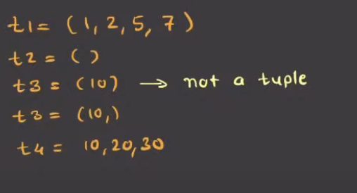
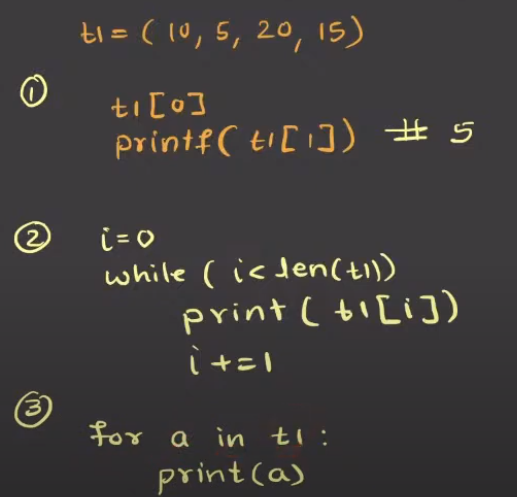
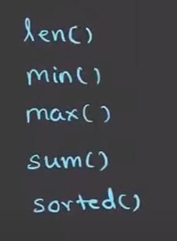
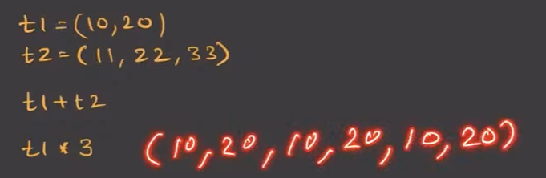
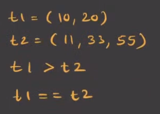

# Tuple
- t1 = (1,) # tuple with 1 element
(just like: l1 = [1,2,3,])

# How to create a tuple

# Accessing tuple elements
  

# Built-in Methods

# Concatenation and Repetition Operator

# Comparison Operator

# Tuple Object Methods
- index()
- count()

# When to Use Tuples
- When data should be fixed (coordinates, config values).
- For hashable keys (like dictionary keys).
- To signal read-only data. (Use lists for mutable sequences.)