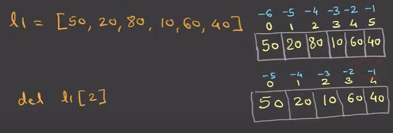
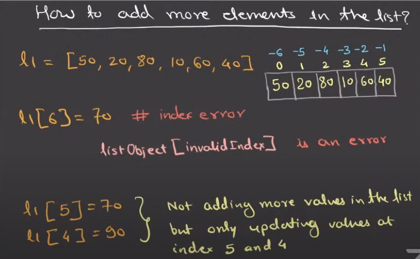
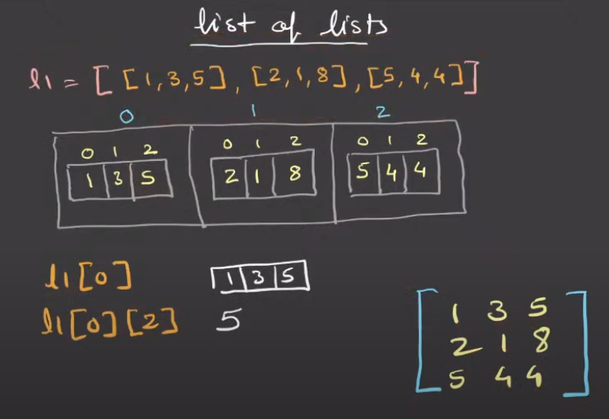

# List
- A list is a class. It is a **mutable**, **growable**, ordered collection of items (i.e **iterable sequence**).
- Lists can contain elements of different types (heterogeneous data).
- Lists elements are indexed.

# How to create a list object?
- Use square brackets: `my_list = [1, 2, 3]`
- Use the `list()` constructor: `my_list = list((1, 2, 3))`
- l = list() # create an empty list: l = [], NOTE: list() accepts either zero or one argument (i.e iterable).
- l = list(10) # Raises TypeError: 'int' object is not iterable.
- Use list comprehension: `my_list = [x for x in range(5)]`
- Use the `*` operator to unpack: `my_list = [*range(5)]`
- Use the `list` function on an iterable: `my_list = list('hello')`  # Output: ['h', 'e', 'l', 'l', 'o']
- Use the `list` function on a string: `my_list = list('hello')`  # Output: ['h', 'e', 'l', 'l', 'o']
- Use the `list` function on a range: `my_list = list(range(5))`  # Output: [0, 1, 2, 3, 4]
- Use the `list` function on a set: `my_list = list({1, 2, 3})`  # Output: [1, 2, 3] (order may vary)
- Use the `list` function on a dictionary: `my_list = list({'a': 1, 'b': 2})`  # Output: ['a', 'b'] (keys only)
- Use the `list` function on a tuple: `my_list = list((1, 2, 3))`  # Output: [1, 2, 3]
- Use the `list` function on a generator: `my_list = list(x for x in range(5))`  # Output: [0, 1, 2, 3, 4]
- Use the `list` function on a file object:
  ```python
  with open('file.txt') as f:
      my_list = list(f)
  ```             
- Use the `list` function on a numpy array: `import numpy as np; my_list = list(np.array([1, 2, 3]))`  # Output: [1, 2, 3]
- Use the `list` function on a pandas Series: `import pandas as pd; my_list = list(pd.Series([1, 2, 3]))`  # Output: [1, 2, 3]
- Use the `list` function on a range with a step: `my_list = list(range(0, 10, 2))`  # Output: [0, 2, 4, 6, 8]
- Use the `list` function on a string with a step: `my_list = list('hello'[::2])`  # Output: ['h', 'l', 'o']
- Use the `list` function on a set with a step: `my_list = list({1, 2, 3, 4, 5})[::2]`  # Output: [1, 3, 5] (order may vary)
- Use the `list` function on a dictionary with a step: `my_list = list({'a': 1, 'b': 2, 'c': 3})[::2]`  # Output: ['a', 'c'] (keys only)
- Use the `list` function on a tuple with a step: `my_list = list((1, 2, 3, 4, 5))[::2]`  # Output: [1, 3, 5]
- Use the `list` function on a generator with a step: `my_list = list(x for x in range(10))[::2]`  # Output: [0, 2, 4, 6, 8]
- Use the `list` function on a file object with a step:
  ```python
  with open('file.txt') as f:
      my_list = list(f)[::2]
  ```
# How to delete an element from a list by value
`del my_list[0]`  # Deletes the first element


# How to add elements to a list
 Use `append()`, `extend()`, or `insert()` methods.
 - `append()` adds a single element to the end.
 - `extend()` adds multiple elements to the end.
 - `insert(index, value)` adds an element at a specific index. (if index > last index,  it will be added at the end.)


# Packing and Unpacking
```
l1 = [1, 2, 3]
a, b, c = l1  # Unpacking, number of variables must match the number of elements in the list
a, b, c = l1[:2]  # This would raise an error
print(a, b, c)  # Output: 1 2 3
```

```
a, *b = l1  # Packing, b will be a list containing the remaining elements
print(a)  # Output: 1
print(b)  # Output: [2, 3]
```

```
a = 1
b = 2
c = 3
l2 = [a, b, c]  # Packing variables into a list
```

# Built-in functions (applicable to all iterables)
- `len()`: Returns the number of elements in the list.
- `max()`: Returns the maximum element in the list.
- `min()`: Returns the minimum element in the list.
- `sum()`: Returns the sum of all elements in the list (if they are numeric). 
- `sorted(iterator, reverse=False)`: Returns a new sorted list from the elements of the iterable.
- `reversed()`: Returns a reverse iterator over the elements of the list.
- `any()`: Returns True if any element of the iterable is true.
- `all()`: Returns True if all elements of the iterable are true.
- `enumerate()`: Returns an iterator that produces pairs of index and value for each element in the list.
- `zip()`: Combines multiple iterables into tuples, pairing elements by their index.
- `map()`: Applies a function to every item of the iterable and returns a map object (which can be converted to a list).
- `filter()`: Filters elements of the iterable based on a function and returns a filter object (which can be converted to a list).

## NOTES
```
l = [1, 2, 3+4j, 5]
max(l) # Raises TypeError: can't compare complex to int
print(sum(l)) # Output: (11+4j)
l.append('a')
sum(l) # Now raises TypeError: unsupported operand type(s) for +: 'int' and 'str'
```
sum() can handle complex numbers, but max() cannot compare them with integers.

# Compare two lists for equality
```python
l1 = [1, 2, 3]
l2 = [1, 2, 3]
print(l1 == l2)  # Output: True
print(l1 is l2)  # Output: False    
```
**Explanation**: `is` checks if both variables point to the same object in memory, while `==` checks if the contents of the objects are equal.

```python
l3 = [2, 3, 1]
print(l1 > l3)  # Output: False, because lists are compared lexicographically (element by element).
```

# Concatenate two lists
```
l1 = [1, 2, 3]
l2 = [4, 5, 6]  
l3 = l1 + l2  # Using the + operator
print(l3)  # Output: [1, 2, 3, 4, 5, 6]
```

# List repetition operator
```
l = [1, 2, 3]
print(l * 2)  # Output: [1, 2, 3, 1, 2, 3]
print(l * 3.5)  # Raises TypeError: can't multiply sequence by non-int of type 'float'
```
# List concatenation operator
```
l = [4, 5, 6]
print(l + [7, 8, 9])  # Output: [4, 5, 6, 7, 8, 9]
```
# List unpacking
```
l = [*range(5)]
print(l)  # Output: [0, 1, 2, 3, 4]
```
# List constructor
```l = list('hello')
print(l)  # Output: ['h', 'e', 'l', 'l', 'o'] 
```

# List comprehension
- Syntax: [expression for variable in iterable]
```l = [x for x in range(5)]
print(l)  # Output: [0, 1, 2, 3, 4] 
```
## List comprehension with condition
```l = [x for x in range(10) if x % 2 == 0]
print(l)  # Output: [0, 2, 4, 6, 8] 
```
## List comprehension with nested loops
```l = [x * y for x in range(3) for y in range(3)]
print(l)  # Output: [0, 0, 0, 0, 1, 1, 1, 2, 2, 2]  
```
## List comprehension with if-else
```l = [x if x % 2 == 0 else -x for x in range(5)]
print(l)  # Output: [0, -1, 2, -3, 4]
```
## List comprehension with function call
```l = [str(x) for x in range(5)]
print(l)  # Output: ['0', '1', '2', '3', '4']   
```
## List comprehension with multiple conditions
```l = [x for x in range(10) if x % 2 == 0 and x > 2]
print(l)  # Output: [4, 6, 8]   
```
## List comprehension with nested lists
```l = [[x, x + 1] for x in range(5)]
print(l)  # Output: [[0, 1], [1, 2], [2, 3], [3, 4], [4, 5]]    
```
## List comprehension with function call and condition
```l = [x**2 for x in range(10) if x % 2 == 0]
print(l)  # Output: [0, 4, 16, 36, 64, 100]
```
## List comprehension with multiple nested loops
```l = [x * y for x in range(3) for y in range(3)]
print(l)  # Output: [0, 0, 0, 0, 1, 1, 1, 2, 2, 2]
```

# List of Lists


# List Object Methods
- `append(x)`: Adds an item x to the end of the list.
- `extend(iterable)`: Extends the list by appending elements from an iterable.
- `insert(i, x)`: Inserts an item x at a given position i.

- `remove(x)`: Removes the first item from the list whose value is equal to x. Gives ValueError if x is not present in the list. Doesn't return anything.
- `pop([i])`: Removes and returns the item at the given position i in the list. If no index is specified, `pop()` removes and returns the last item in the list.
- `clear()`: Removes all items from the list.
 
- `index(x[, start[, end]])`: Returns the index of the first item whose value is equal to x. Raises a ValueError if not found.
- `count(x)`: Returns the number of times x appears in the list.
- `sort(key=None, reverse=False)`: Sorts the items of the list in place (the arguments can be used for sort customization).
- `reverse()`: Reverses the elements of the list in place.
- `copy()`: Returns a shallow copy of the list.

## NOTE:
```
l = ['A', 'B', 'C']
del l[0]  # Deletes the first element 'A'
l.clear()  # Clear the list
print(l)  # Output: []
del l  # Deletes the entire list object
# print(l)  # Raises NameError: name 'l' is not defined
```
